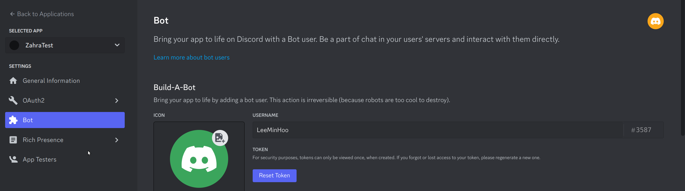
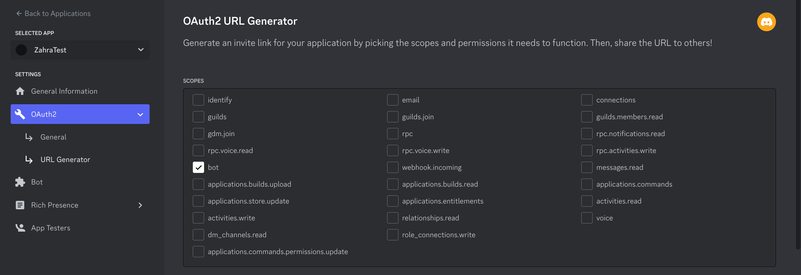
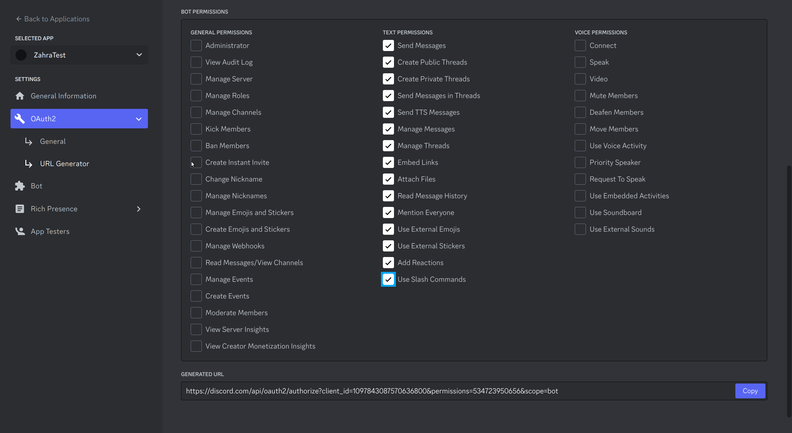
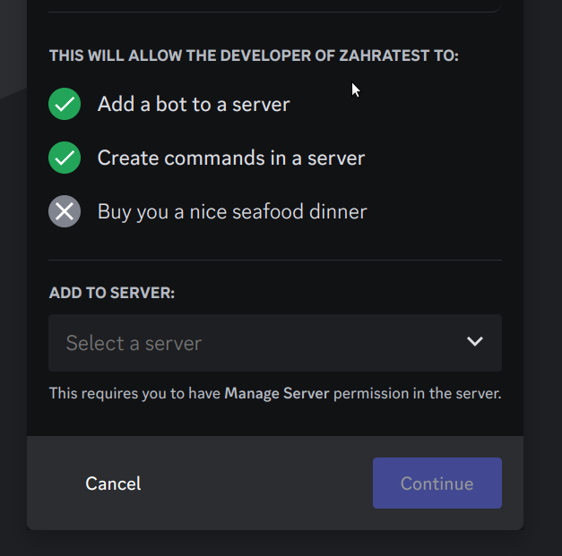
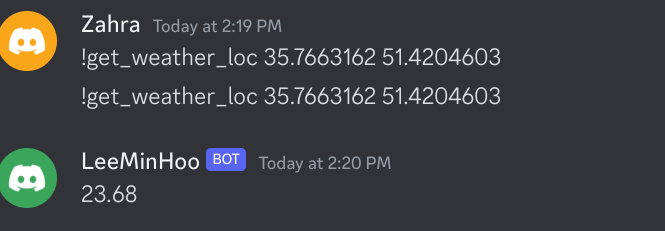
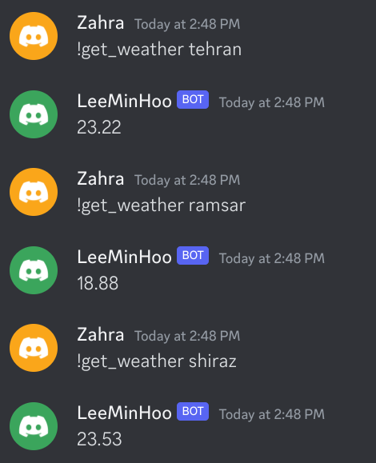

# Making a bot!
## Creating a bot in discord
1. Login to discord website(discord.com)
2. Go to [Application page](https://discord.com/developers/applications)
  * Click on New Application and choose a name

  * Go to bot page an enter the data


## Setup python script
```bash
python -m venv venv
. venv/bin/activate
pip install discord.py
```


```python
# main.py
import discord
import os

client = discord.Client()

@client.event
async def on_ready():
    print('We have logged in as {0.user}'.format(client))

@client.event
async def on_message(message):
    if message.author == client.user:
        return

    if message.content.startswith('$hello'):
        await message.channel.send('Hello!')

client.run(os.getenv('TOKEN'))
```

### Error: TypeError: Client.__init__() missing 1 required keyword-only argument: 'intents'
After a quick search, update the code to:
```python
client = discord.Client(intents=discord.Intents.all()) # Add intents to client
```

### Error: TypeError: expected token to be a str, received NoneType instead
```
2023-04-25 12:57:49 INFO     discord.client logging in using static token
Traceback (most recent call last):
  File "/home/atrin/Developer/Projects/Zahra/practical_python/discord-bot/main.py", line 18, in <module>
    client.run(os.getenv('TOKEN'))
  File "/home/atrin/Developer/Projects/Zahra/practical_python/discord-bot/venv/lib/python3.10/site-packages/discord/client.py", line 860, in run
    asyncio.run(runner())
  File "/usr/lib/python3.10/asyncio/runners.py", line 44, in run
    return loop.run_until_complete(main)
  File "/usr/lib/python3.10/asyncio/base_events.py", line 649, in run_until_complete
    return future.result()
  File "/home/atrin/Developer/Projects/Zahra/practical_python/discord-bot/venv/lib/python3.10/site-packages/discord/client.py", line 849, in runner
    await self.start(token, reconnect=reconnect)
  File "/home/atrin/Developer/Projects/Zahra/practical_python/discord-bot/venv/lib/python3.10/site-packages/discord/client.py", line 777, in start
    await self.login(token)
  File "/home/atrin/Developer/Projects/Zahra/practical_python/discord-bot/venv/lib/python3.10/site-packages/discord/client.py", line 609, in login
    raise TypeError(f'expected token to be a str, received {token.__class__.__name__} instead')
TypeError: expected token to be a str, received NoneType instead
```
From the stack, we can see that error is from `client.run(os.getenv('TOKEN'))`

We need to add the discord token, we can
1. Set a static variable in python code(not a great idea for security)
```python
token = '...'
client.run(token)
```
2. setup the token in bash environment
```bash
# with python
TOKEN=... python3 main.py
# With export
export TOKEN=...
python3 main.py
```
3. Create .env file and use the dotenv package
```bash
pip install python-dotenv
```
```bash
# .env
TOKEN=...
```
```python
from dotenv import load_dotenv

load_dotenv()

token = os.getenv('TOKEN')
```
You can also add `.env` to `.gitignore`.

### Setup bot url in discord
In the discord [Application page](https://discord.com/developers/applications):
1. Select your application
2. Go to OAuth/URL Generator

3. Select bot and set the permissions
4. Copy the generated url


### Add the bot to a group
1. Open the generated url in the step above
2. Select the server you want to add the bot to

3. Grant Permissions to the bot

## Sample bot command
```python
import discord
import os
import random

from dotenv import load_dotenv
from discord.ext import commands

load_dotenv()
TOKEN = os.getenv('TOKEN')

bot = commands.Bot(command_prefix='!', intents=discord.Intents.all())

@bot.command(name='99', help='Random thing')
async def nine_nine(ctx):
    brooklyn_99_quotes = [
        'I\'m the human form of the 💯 emoji.',
        'Bingpot!',
        (
            'Cool. Cool cool cool cool cool cool cool, '
            'no doubt no doubt no doubt no doubt.'
        ),
    ]

    response = random.choice(brooklyn_99_quotes)
    await ctx.send(response)

bot.run(TOKEN)
```

Result:
```
-- !help
​No Category:
  99   Random thing
  help Shows this message

Type !help command for more info on a command.
You can also type !help category for more info on a category.

-- !99
Bingpot!

-- !99
I\'m the human form of the 💯 emoji.
```

## Get weather with location data
```python
@bot.command(name='get_weather_loc', help='Get weather data with lat/lon')
async def translate(ctx, lat: float, lon: float):
    response = requests.get('https://api.openweathermap.org/data/2.5/weather', {
        'lat' : lat,
        'lon': lon,
        'appid': os.getenv('API_KEY'),
        'units': 'metric',
    })
    data = response.json()
    
    
    await ctx.send(data['main']['temp'])
```

### name='get_weather_loc' ,lat: float, lon: float



## Get weather with city name:
### Only return one city
```python
@bot.command(name='get_weather', help='Get weather data by city')
async def get_weather(ctx):
    response = requests.get('https://api.openweathermap.org/data/2.5/weather', {
        'lat': cities['tehran']['lat'],
        'lon': cities['tehran']['lon'],
        'appid': os.getenv('API_KEY'),
        'units': 'metric',
    })
    data = response.json()
    
    
    await ctx.send(data['main']['temp'])

```


### Different cities

```python
@bot.command(name='get_weather', help='Get weather data by city(tehran, shiraz, esfahan, ramsar)')
async def get_weather(ctx, city: str):
    response = requests.get('https://api.openweathermap.org/data/2.5/weather', {
        'lat': cities[city]['lat'],
        'lon': cities[city]['lon'],
        'appid': os.getenv('API_KEY'),
        'units': 'metric',
    })
    data = response.json()
    
    
    await ctx.send(data['main']['temp'])
```

