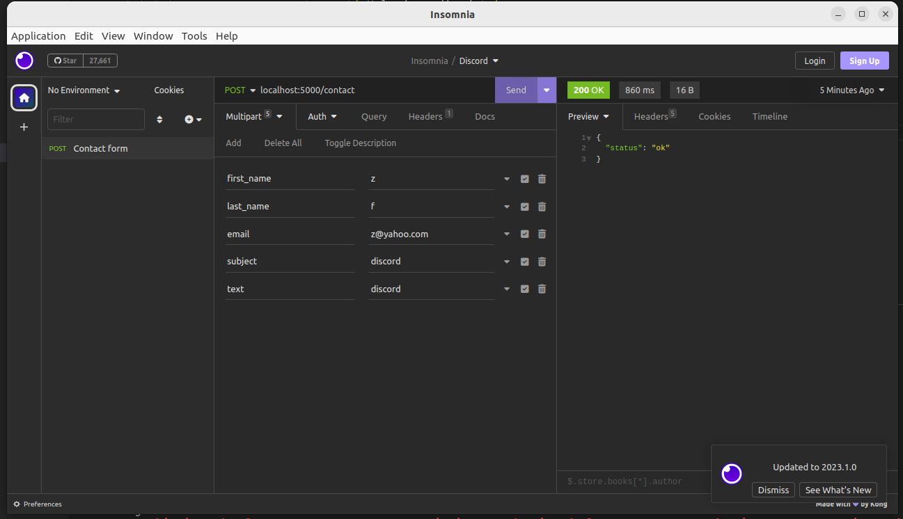
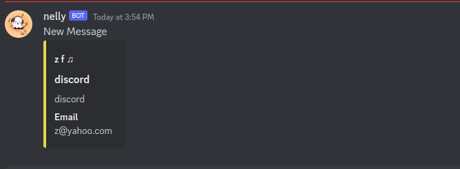

# Task: Send contact form to discord:
```
frontend(insomnia) --> flask --- convert format ---> discord
```

## install flask

```bash
pip install flask
```

## Setting up flask
```python
from flask import Flask
from flask import request, jsonify

app = Flask(__name__)


@app.route('/contact', methods=['POST',])
def contact(): # localhost:5000/contact
  return jsonify({'status': 'ok'})

if __name__ == '__main__':
  app.run() # localhost:5000

```
Run with:
```bash
python 2.py
```

## Get user data
```python

@app.route('/contact', methods=['POST',])
def contact():
    if request.method == 'POST':
        data = request.form
        # first_name = data['first_name'] -> might send error
        first_name = data.get('first_name') # doesnt send error
        last_name = data.get('last_name')
        email = data.get('email')
        subject = data.get('subject')
        text = data.get('text')
        ...
```

## Send data to discord
```python

@app.route('/contact', methods=['POST',])
def contact():
    if request.method == 'POST':
        data = request.form
        first_name = data.get('first_name')
        last_name = data.get('last_name')
        email = data.get('email')
        subject = data.get('subject')
        text = data.get('text')

        dis_data = {
            "username": "nelly",
            "avatar_url": "https://i.imgur.com/4M34hi2.png",
            "content": "New Message",
            "embeds": [
                {
                    "author": {
                        "name": f"{first_name} {last_name} ♫", # use f-string
                    },
                    "fields": [
                        {
                            "name": "Email",
                            "value": email, # use variable value
                            "inline": True
                        },],
                    "title": subject,
                    "description": text,
                    "color": 15258703,

                }]
        }
        response = requests.post(mUrl, json=dis_data)

        print(response.status_code)

        print(response.content)
```

# testing with insomnia
* Create a new collection
* Setup a request
* Set the method to `POST` and url to `localhost:5000/contact`
* Set the body to multipart form and enter the following data
```
first_name
last_name
email
subject
text
```


# Result!
```python
from flask import Flask
from flask import request, jsonify
import requests
mUrl = "https://discordapp.com/api/webhooks/1097824674748055613/dmQYy7ZR1JHDiJ4I6HSYg9v-l9bGg_K8Dca-QOjtxKhZnjbEqGGpmZdEVTfHVX4Xrmb2"


app = Flask(__name__)


@app.route('/contact', methods=['POST',])
def contact():
    if request.method == 'POST':
        data = request.form
        first_name = data.get('first_name')
        last_name = data.get('last_name')
        email = data.get('email')
        subject = data.get('subject')
        text = data.get('text')

        dis_data = {
            "username": "nelly",
            "avatar_url": "https://i.imgur.com/4M34hi2.png",
            "content": "New Message",
            "embeds": [
                {
                    "author": {
                        "name": f"{first_name} {last_name} ♫",
                        # "url": f"mail:{email}",

                    },
                    "fields": [
                        {
                            "name": "Email",
                            "value": email,
                            "inline": True
                        },],
                    "title": subject,
                    "description": text,
                    "color": 15258703,

                },]
        }
        response = requests.post(mUrl, json=dis_data)

        print(response.status_code)

        print(response.content)

        return jsonify({'status': 'ok'})


if __name__ == '__main__':
    app.run()

```


# Publishing on git
## Setup git
```bash
git init
```
## Setup git default branch
```bash
git config --global init.defaultBranch main
git branch -M main
```
## Adding  project files
```bash
git add -A
git commit -m "webhook discord"
 
```
## Setup repo:
* Create repo on github(PracticalPython)
```bash
git remote add origin git@github.com:zahrafarrokhi/practical_python.git
git push -u origin main
```

## ssh key

```bash
settings => ssh => new ssh => type authentication
cd ~/.ssh
ls
cat id_ed25519.pub
```